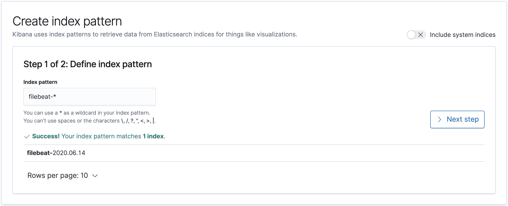
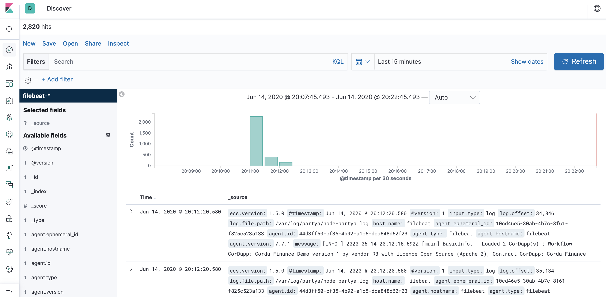
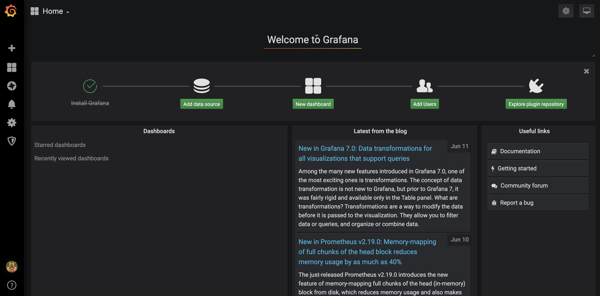
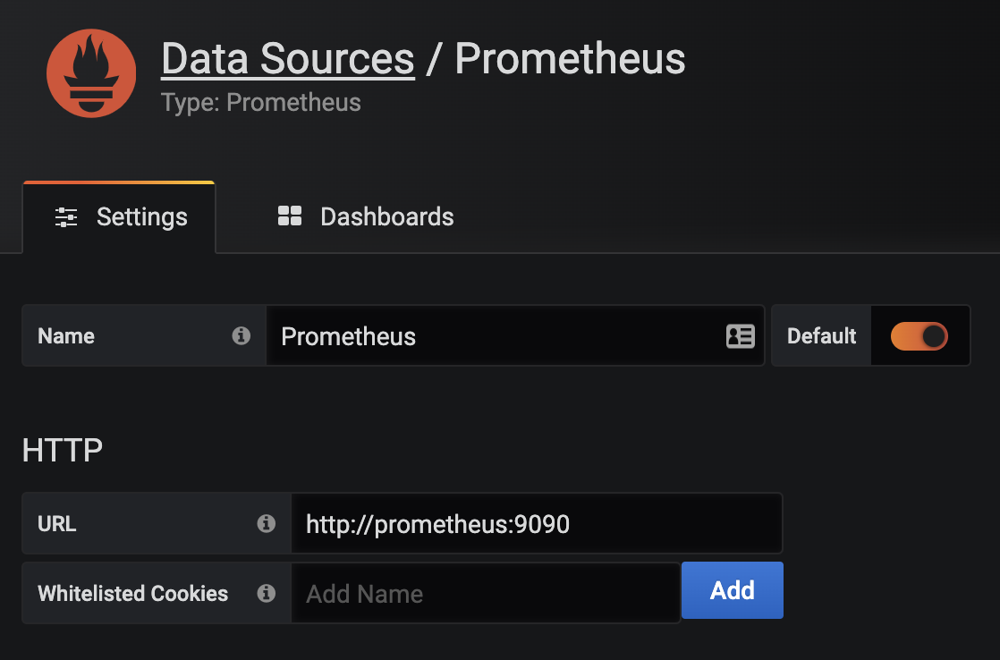
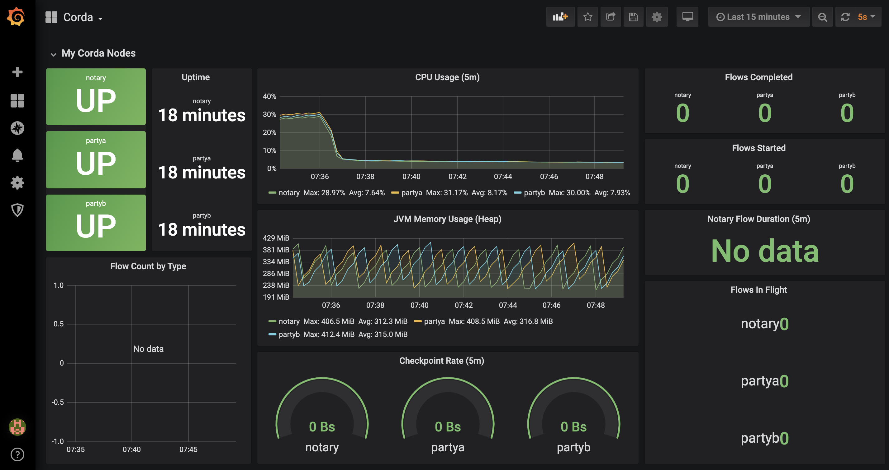
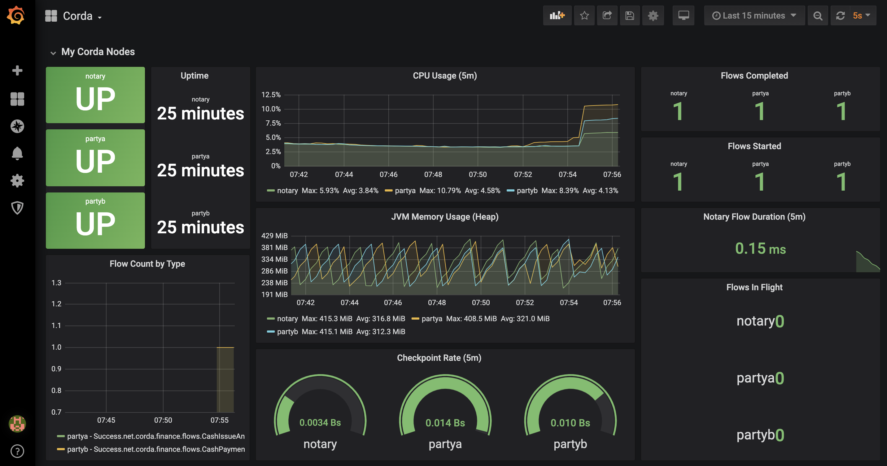
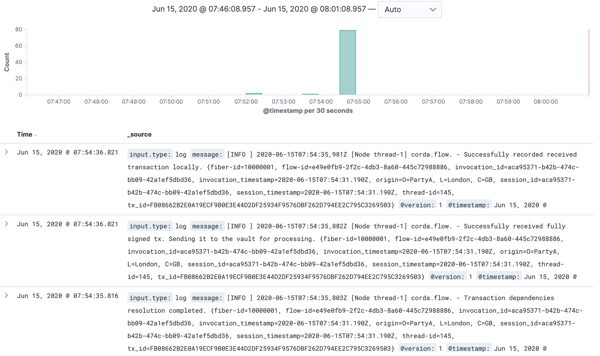

# Monitoring Corda Nodes With Prometheus, Grafana and ELK on Docker

- [Monitoring Corda Nodes With Prometheus, Grafana and ELK on Docker](#monitoring-corda-nodes-with-prometheus-grafana-and-elk-on-docker)
  - [Blogpost](#blogpost)
  - [Step 1: Prepare the workspace directory](#step-1-prepare-the-workspace-directory)
  - [Step 2: Create node configuration files](#step-2-create-node-configuration-files)
  - [Step 3: Run the Corda Network Bootstrapper](#step-3-run-the-corda-network-bootstrapper)
  - [Step 4: Preparing for Docker](#step-4-preparing-for-docker)
  - [Step 5: Create the Prometheus configuration files](#step-5-create-the-prometheus-configuration-files)
  - [Step 6: Create the Docker-Compose file](#step-6-create-the-docker-compose-file)
  - [Step 7: Setup Kibana](#step-7-setup-kibana)
  - [Step 8: Setup Grafana](#step-8-setup-grafana)
  - [Step 9: Run some Corda Finance flows](#step-9-run-some-corda-finance-flows)
  - [Step 10: Explore Grafana and ELK](#step-10-explore-grafana-and-elk)
  - [Common issues](#common-issues)
    - [Docker Desktop OOM](#docker-desktop-oom)
    - [Kibana Date Field format error](#kibana-date-field-format-error)

## Blogpost

Checkout the blogpost [here](https://www.nealshah.dev/posts/2020/06/monitoring-corda-nodes-with-prometheus-grafana-and-elk-on-docker/).

## Step 1: Prepare the workspace directory

We will create the directory structure and download the necessary in this step.  3 jars are required:

- corda-tools-network-bootstrapper-4.4.jar
- corda-finance-contracts-4.4.jar
- corda-finance-workflows-4.4.jar

The two `corda-finance-*.jar`'s make up the Corda Finance CordApp which we will use to test transactions across peer nodes.

Execute the **`01_setup-directory.sh`** shell script:

```bash
➜ ./01_setup-directory.sh
```

You should see a new directory called `mynetwork` created, with a few sub directories and the required jars.

```bash
➜  tree mynetwork
mynetwork
├── corda-finance-contracts-4.4.jar
├── corda-finance-workflows-4.4.jar
├── corda-tools-network-bootstrapper-4.4.jar
├── grafana
├── prometheus
├── filebeat
├── logstash
└── shared
    ├── additional-node-infos
    ├── cordapps
    └── drivers
        └── jmx_prometheus_javaagent-0.13.0.jar
```

## Step 2: Create node configuration files

We will require 4 node configurations:

- Notary
- PartyA
- PartyB

Execute the **`02_create-node-configurations.sh`** shell script:

```bash
➜ ./02_create-node-configurations.sh
```

Our `mynetwork` directory now looks like the following:

```bash
➜  tree mynetwork
mynetwork
├── corda-finance-contracts-4.4.jar
├── corda-finance-workflows-4.4.jar
├── corda-tools-network-bootstrapper-4.4.jar
├── grafana
├── filebeat
├── logstash
├── notary_node.conf
├── partya_node.conf
├── partyb_node.conf
├── prometheus
└── shared
    ├── additional-node-infos
    ├── cordapps
    └── drivers
        └── jmx_prometheus_javaagent-0.13.0.jar
```

This will create three `.conf` files, each representing a single node.

Here's an example of the `partya_node.conf` file:

```conf
devMode=true
emailAddress="test@test.com"
myLegalName="O=PartyA, L=London, C=GB"
p2pAddress="partya:10200"
rpcSettings {
    address="0.0.0.0:10201"
    adminAddress="0.0.0.0:10202"
}
security {
    authService {
        dataSource {
            type=INMEMORY
            users=[
                {
                    password="password"
                    permissions=[
                        ALL
                    ]
                    username=user
                }
            ]
        }
    }
}
cordappSignerKeyFingerprintBlacklist = []
sshd {
  port = 2222
}
```

## Step 3: Run the Corda Network Bootstrapper

The [Corda Network Bootstrapper](https://docs.corda.net/docs/corda-os/4.4/network-bootstrapper.html#bootstrapping-a-test-network) will create a development network of peer nodes, using dev certificates.  You don't need to worry about registering nodes, the bootstrapper takes care of that for you.

Execute the **`03_run-corda-network-bootstrapper.sh`** shell script:

```bash
➜ ./03_run-corda-network-bootstrapper.sh

Bootstrapping local test network in /corda-monitoring-prometheus-grafana/mynetwork
Generating node directory for partya
Generating node directory for notary
Generating node directory for partyb
Nodes found in the following sub-directories: [notary, partya, partyb]
Found the following CorDapps: [corda-finance-workflows-4.4.jar, corda-finance-contracts-4.4.jar]
Copying CorDapp JARs into node directories
Waiting for all nodes to generate their node-info files...
Distributing all node-info files to all nodes
Loading existing network parameters... none found
Gathering notary identities
Generating contract implementations whitelist
New NetworkParameters {
      minimumPlatformVersion=6
      notaries=[NotaryInfo(identity=O=Notary, L=London, C=GB, validating=false)]
      maxMessageSize=10485760
      maxTransactionSize=524288000
      whitelistedContractImplementations {

      }
      eventHorizon=PT720H
      packageOwnership {

      }
      modifiedTime=2020-06-09T15:29:59.724Z
      epoch=1
  }
Bootstrapping complete!
```

## Step 4: Preparing for Docker

There are some common files that are shared between the peer nodes.  Let's put these in one folder - this will make our Docker-Compose service volumes a bit clearer to read.

Execute the **`04_copy-common-files.sh`** shell script:

```bash
➜ ./04_copy-common-files.sh
```

This will copy across common files to the `./mynetwork/shared` folder.

## Step 5: Create the Prometheus configuration files

Execute the **`05_create-monitoring-configurations.sh`** shell script:

```bash
➜ ./05_create-monitoring-configurations.sh
```

This creates a config file in `./mynetwork/prometheus/prometheus.yml`:

```yaml
global:
  scrape_interval: 5s
  external_labels:
    monitor: "corda-network"
scrape_configs:
  - job_name: "notary"
    static_configs:
      - targets: ["notary:8080"]
    relabel_configs:
      - source_labels: [__address__]
        regex: "([^:]+):\\d+"
        target_label: instance
  - job_name: "nodes"
    static_configs:
      - targets: ["partya:8080", "partyb:8080"]
    relabel_configs:
      - source_labels: [__address__]
        regex: "([^:]+):\\d+"
        target_label: instance
```

Check out the `./mynetwork/filebeat/` and `./mynetwork/logstash/` directories for their respective configuration files.

We define the JMX exporter targets (endpoints) for each node.  They are all using port 8080 - don't worry about port conflicts, Docker will take care of the networking.

## Step 6: Create the Docker-Compose file

Finally, we need a `docker-compose.yml` file which allows us to bring up all the services in just one command.

Execute the **`06_create-docker-compose-file.sh`** shell script:

```bash
➜ ./06_create-docker-compose.sh
```

You can find the `docker-compose.yml` file in `./mynetwork/docker-compose.yml`.  Inside the file, we have created services for Prometheus, Grafana, ELK and Filebeat:

```yaml
...
  prometheus:
    image: prom/prometheus:latest
    container_name: prometheus
    ports:
      - 9090:9090
    command:
      - --config.file=/etc/prometheus/prometheus.yml
    volumes:
      - ./prometheus/prometheus.yml:/etc/prometheus/prometheus.yml:ro

  grafana:
    hostname: grafana
    container_name: grafana
    image: grafana/grafana:latest
    ports:
      - 3000:3000
    volumes:
      - ./grafana/data:/var/lib/grafana
    environment:
      - "GF_INSTALL_PLUGINS=grafana-clock-panel"

  elk:
      hostname: elk
      container_name: elk
      image: sebp/elk
      volumes:
        - ./logstash/02-beats-input.conf:/etc/logstash/conf.d/02-beats-input.conf
      ports:
        - "5601:5601"
        - "9200:9200"
        - "5044:5044"

  filebeat:
    hostname: filebeat
    container_name: filebeat
    image: docker.elastic.co/beats/filebeat:7.7.1
    volumes:
      - ./filebeat/filebeat.yml:/usr/share/filebeat/filebeat.yml:ro
      - ./partya/logs/node-partya.log:/var/log/node-partya.log
      - ./partyb/logs/node-partyb.log:/var/log/node-partyb.log
      - ./notary/logs/node-notary.log:/var/log/node-notary.log
      - /var/lib/docker/containers:/var/lib/docker/containers:ro
    environment:
      - "setup.kibana.host=elk:5601"
      - "output.elasticsearch.hosts=["elk:9200"]"
    depends_on:
      - elk
```

Start up the services using the following command:

```bash
➜ docker-compose -f ./mynetwork/docker-compose.yml up -d

Creating network "mynetwork_default" with the default driver
Creating grafana    ... done
Creating partyb     ... done
Creating prometheus ... done
Creating partya     ... done
Creating elk        ... done
Creating notary     ... done
Creating filebeat   ... done
```

> ELK can take a little while to start up, you can track its progress by following the container logs:  `docker logs -f elk`.  
> The ELK start will be fully started when you see the following output:

```bash
➜ docker logs -f elk
...
[2020-06-14T20:12:53,575][INFO ][logstash.inputs.beats    ] Beats inputs: ?Starting input listener {:address=>"0.0.0.0:5044"}
[2020-06-14T20:12:53,595][INFO ][logstash.javapipeline    ] Pipeline started {"pipeline.id"=>"main"}
[2020-06-14T20:12:53,765][INFO ][logstash.agent           ] Pipelines running {:count=>1, :running_pipelines=>[:main], :non_running_pipelines=>[]}
[2020-06-14T20:12:53,772][INFO ][org.logstash.beats.Server] Starting server on port: 5044
[2020-06-14T20:12:54,398][INFO ][logstash.agent           ] Successfully started Logstash API endpoint {:port=>9600}
```

View running containers:

```bash
➜ docker ps -a
CONTAINER ID        IMAGE                                    COMMAND                  CREATED             STATUS              PORTS                                                                              NAMES
a35d3042490d        docker.elastic.co/beats/filebeat:7.7.1   "/usr/local/bin/dock…"   4 minutes ago       Up 4 minutes                                                                                           filebeat
16e142719907        sebp/elk                                 "/usr/local/bin/star…"   4 minutes ago       Up 4 minutes        0.0.0.0:5044->5044/tcp, 0.0.0.0:5601->5601/tcp, 0.0.0.0:9200->9200/tcp, 9300/tcp   elk
f2310f6d336f        corda/corda-zulu-java1.8-4.4:latest      "run-corda"              4 minutes ago       Up 4 minutes        10200/tcp, 0.0.0.0:2222->2222/tcp, 10202/tcp, 0.0.0.0:10005->10201/tcp             partya
e04278061856        corda/corda-zulu-java1.8-4.4:latest      "run-corda"              4 minutes ago       Up 4 minutes        10200/tcp, 10202/tcp, 0.0.0.0:10002->10201/tcp                                     notary
61aeb9a442a9        corda/corda-zulu-java1.8-4.4:latest      "run-corda"              4 minutes ago       Up 4 minutes        10200/tcp, 10202/tcp, 0.0.0.0:3333->2222/tcp, 0.0.0.0:10008->10201/tcp             partyb
712b28c69970        prom/prometheus:latest                   "/bin/prometheus --c…"   4 minutes ago       Up 4 minutes        0.0.0.0:9090->9090/tcp                                                             prometheus
97a5c3bc19ce        grafana/grafana:latest                   "/run.sh"                4 minutes ago       Up 4 minutes        0.0.0.0:3000->3000/tcp                                                             grafana
```

## Step 7: Setup Kibana

Head over to your browser, and go to [http://localhost:5601](http://localhost:5601).  You should see the Kibana homepage.

On the left pane, click on the cog icon.

Under `Kibana`, click `Index Patterns`.

Click `Create Index Pattern`.

In the `Index pattern` field, enter `filebeat-*`.



Click `Next step`.

Under the `Time Filter field name` dropdown, select `@timestamp`.

Click `Create Index Pattern`.

Voila, your index pattern has been created!

Click on the `Discover` icon on the left pane, you should see some logs:



## Step 8: Setup Grafana

On your browser, go to [http://localhost:3000](http://localhost:3000).

Grafana will ask you for a login, the default admin login is:

- Username: admin
- Password: admin

Change your password as instructed, and then you should see the Grafana homepage.



Click on `Add data source`.

Select the `Prometheus` data source under `Time series databases`.

Under `HTTP`, set the `URL` to `http://prometheus:9090`.  You can use the Prometheus Docker container hostname here as all of the containers run on the same Docker bridge network, so no explicit container IP addresses need to be used for connectivity.



At the bottom of the page, click on `Save & Test`.  You should see a green alert - `Data source is working`.

Hover over the `Dashboards` icon, and click `Manage`.

Click `Import`, then `Upload .json file`, and navigate to the clone repository folder.  Inside the `grafana` folder, you will see a json file - `Grafana-Corda-Dashboard.json`, see [here](./grafana/Grafana-Corda-Dashboard.json).

On the following screen, click `Import`.

Boom, a dashboard appears!



## Step 9: Run some Corda Finance flows

SSH into the PartyA node Crash shell:

```bash
➜ ssh user@localhost -p 2222
```

When prompted, the password is `password`.

You should see the following in your terminal:

```bash
Welcome to the Corda interactive shell.
You can see the available commands by typing 'help'.

Mon Jun 15 07:52:13 GMT 2020>>>
```

Let's execute a `CashIssueAndPaymentFlow`:

```bash
Mon Jun 15 07:53:52 GMT 2020>>> flow start CashIssueAndPaymentFlow amount: 1000 GBP, issueRef: TestTransaction, recipient: PartyB, anonymous: false, notary: Notary

 ✓ Starting
 ✓ Issuing cash
          Generating anonymous identities
     ✓ Generating transaction
     ✓ Signing transaction
     ✓ Finalising transaction
              Requesting signature by notary service
                  Requesting signature by Notary service
                  Validating response from Notary service
         ✓ Broadcasting transaction to participants
 ✓ Paying recipient
     ✓ Generating anonymous identities
     ✓ Generating transaction
     ✓ Signing transaction
     ✓ Finalising transaction
         ✓ Requesting signature by notary service
             ✓ Requesting signature by Notary service
             ✓ Validating response from Notary service
         ✓ Broadcasting transaction to participants
▶︎ Done
Flow completed with result: Result(stx=SignedTransaction(id=FB08662B2E0A19ECF9B0E3E44D2DF25934F9576DBF262D794EE2C795C3269503), recipient=O=PartyB, L=London, C=GB)
```

## Step 10: Explore Grafana and ELK

Go back to your [Grafana dashboard](http://localhost:3000).  You will see the following:



In another browser window/tab, go to the [Kibana](http://localhost:5601) and click on the `Discover` icon.

You should see the following:



## Common issues

### Docker Desktop OOM

If your containers are exiting with code 137, this is a Docker out-of-memory (OOM) exception.

Go to **Docker Desktop** -> **Preferences** -> **Resources**.  Increase the `Memory` to 10.00 GB, then **Apply & Restart**.

### Kibana Date Field format error

If you see the following error:

>Discover: failed to parse date field [-1830383031864] with format [epoch_millis]: [failed to parse date field [-1830383031864] with format [epoch_millis]]

Click the `Settings` icon, then under Kibana, click `Advanced Settings`.  Under `Time zone for date formatting`, look for your correct time zone (UTC).
